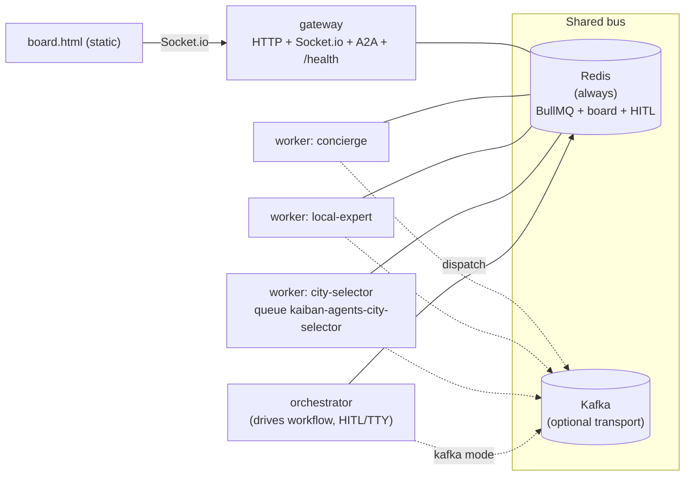
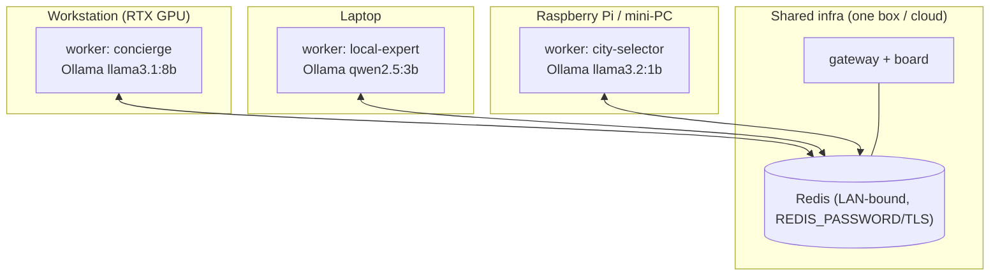

# Deployment

This repo is **not a single app** — each example is a set of **long-lived, stateful
actor processes** built on the [`kaiban-distributed`](https://github.com/andreibesleaga/kaiban-distributed)
runtime. The deployment story is therefore "run N small always-on processes that share
a message bus", not "deploy one web service". Everything below follows from that.

## 0. What you actually deploy

One Docker image (the repo [`Dockerfile`](Dockerfile)) serves **every** role; the role is
chosen by the container's start `command`:

| Role | Start command | Notes |
|------|---------------|-------|
| **gateway** | `node node_modules/kaiban-distributed/dist/src/main/index.js` | HTTP + Socket.io board + A2A + `/health` on `PORT` (3000). Env: `ROLE=gateway`, `AGENT_IDS=gateway`. |
| **worker node** (one per agent) | `node dist/<example>/<role>-node.js` | Consumes its own queue `kaiban-agents-<AGENT_ID>`. Env: `AGENT_ID=<id>`. **One process per agent.** |
| **orchestrator** | `node dist/<example>/orchestrator.js` | Drives the workflow; short-lived. HITL examples (e.g. trip-planning) need a **TTY** (`stdin_open`/`tty`). |
| **board** | static `viewer/board.html` + `viewer/board.js` | Connects to the gateway via `window.GATEWAY_URL` or `?gateway=<url>` query param. |

**Transport:** Redis/BullMQ (default, `MESSAGING_DRIVER=bullmq`) **or** Kafka
(`MESSAGING_DRIVER=kafka` + `KAFKA_BROKERS`).
**Redis is ALWAYS required** — even on Kafka, the live board state (`kaiban-state-events`)
and the HITL channels use Redis pub/sub.

### Core env vars (see [`.env.example`](.env.example))

```bash
# Transport
MESSAGING_DRIVER=bullmq            # bullmq (Redis) | kafka
REDIS_URL=redis://host:6379        # ALWAYS required
KAFKA_BROKERS=host:9092            # only when MESSAGING_DRIVER=kafka

# Gateway
PORT=3000
ROLE=gateway                       # gateway role only
AGENT_IDS=gateway                  # gateway role only
GATEWAY_URL=http://gateway:3000    # orchestrator → gateway

# Worker
AGENT_ID=city-selector             # worker role only — picks the agent + its queue

# LLM (choose one provider)
OPENAI_API_KEY=...                 # standard OpenAI
# OPENROUTER_API_KEY=...           # takes priority over OPENAI_API_KEY if set
# OPENAI_BASE_URL=http://host:11434/v1   # any OpenAI-compatible server (Ollama/vLLM/LM Studio)
LLM_MODEL=gpt-4o-mini

# Tools (per example) / spend guard
TAVILY_API_KEY=  SERPER_API_KEY=   # web search (trip-planning)
MAX_WORKFLOW_COST_USD=0.50  MAX_WORKFLOW_TOKENS=0   # 0 = unlimited
```

> RAG (`rag-knowledge-base`) needs `OPENAI_API_KEY` specifically for **embeddings**,
> even if your chat LLM is OpenRouter or a local model.

## 1. Topology recap



**The rule: one OS process per agent.** Scaling, placement and the multi-device swarm
(§9) all follow from this. The orchestrator degrades gracefully if the gateway is down —
the workflow still completes, you just lose the live board.

## 2. Local

**When to use:** development, demos, trying an example end-to-end.

Fully containerised run of one example (Redis + gateway + per-agent workers):

```bash
npm install
cp .env.example .env                # add OPENAI_API_KEY (or OPENROUTER_API_KEY)

docker compose -f trip-planning/docker-compose.yml --env-file .env up -d --build
docker compose -f trip-planning/docker-compose.yml run --rm orchestrator   # interactive (HITL)
# Kafka variant: trip-planning/docker-compose.kafka.yml
# Helper: ./scripts/run-example.sh start trip-planning [--kafka]
```

Open `viewer/board.html` in a browser (connects to the gateway on `:3000`).

**Local-dev / ts-node path** (infra in Docker, code on host — fast iteration):

```bash
docker compose -f docker-compose.infra.yml --env-file .env up -d --build   # redis + gateway
npx ts-node trip-planning/city-selector-node.ts   # one worker per terminal
npx ts-node trip-planning/local-expert-node.ts
npx ts-node trip-planning/concierge-node.ts
npx ts-node trip-planning/orchestrator.ts          # drive it
```

## 3. Railway

**When to use:** the easiest always-on host for this architecture — strong fit.

Railway runs one **service per role** from the same repo `Dockerfile`; you override the
**start command** per service and share env vars.

1. **Redis:** add the Railway **Redis** plugin → it exposes `REDIS_URL` to other services.
2. **gateway service:** deploy the Dockerfile; default `CMD` already runs the gateway.
   Set `ROLE=gateway`, `AGENT_IDS=gateway`, `PORT=3000`, `REDIS_URL`, LLM keys. Expose it
   (Railway gives a public HTTPS domain → use as the board's `?gateway=` URL).
3. **one worker service per agent:** same image, override start command, e.g.
   `node dist/trip-planning/city-selector-node.js`, set `AGENT_ID=city-selector` + LLM keys
   + `REDIS_URL`. Repeat for `local-expert`, `concierge`.
4. **orchestrator:** run as a one-off (`railway run`) or a short-lived service. HITL examples
   need a TTY, so an interactive orchestrator is better triggered from a shell than as a
   background service.
5. Put LLM/tool keys in Railway **secrets**, not plaintext env.

Caveats: workers must stay **always-on** (they are queue consumers) — keep them off any
sleep/free-tier idle policy. Each agent = its own service, so a 3-agent example = Redis +
gateway + 3 workers.

## 4. Vercel

**When to use:** static board hosting and/or a thin "trigger a run" API — **not** the
gateway or workers.

Be honest: Vercel is serverless. It does **not** fit:
- long-lived **BullMQ/Kafka consumers** (workers need a persistent event loop),
- the **persistent Socket.io gateway** (stateful WebSocket server),
- Kafka consumer groups.

Realistic split:
- **Host the static board on Vercel** — deploy `viewer/` as static files; point it at your
  always-on gateway with `?gateway=https://your-gateway.example.com` or by setting
  `window.GATEWAY_URL` in the page.
- **(Optional) a thin trigger API** — a Vercel Function that enqueues "start a run" (publishes
  the initial message) to a **managed Redis** like **Upstash** (`REDIS_URL=rediss://...`).
- **gateway + workers belong on an always-on host** (Railway / Fargate / Container Apps /
  Cloud Run with min-instances ≥ 1 / a VM). Use Upstash/managed Redis as the shared bus so
  both the serverless trigger and the always-on workers talk to the same Redis.

## 5. AWS

**When to use:** you're already on AWS / want managed Redis or Kafka at scale.

Recommended — **ECS / Fargate**, one **service per role** (or one task definition per role):
- **gateway** service: the image's default command, port 3000 behind an ALB; `/health` as the
  target-group health check.
- **one worker service per agent**, command `node dist/<example>/<role>-node.js`,
  `AGENT_ID=<id>`. For competing-consumer agents you can scale `desiredCount > 1`.
- **orchestrator** as a one-off task (`aws ecs run-task`); HITL ones need an interactive
  session (ECS Exec) for the TTY.
- **Redis:** **ElastiCache for Redis** → `REDIS_URL`. **Kafka:** **MSK** → `KAFKA_BROKERS`,
  `MESSAGING_DRIVER=kafka` (Redis/ElastiCache still required for board + HITL).
- Put LLM/tool keys in **Secrets Manager** / SSM Parameter Store and inject as task secrets.

Simpler alternative: a single **EC2** box running `docker compose -f <example>/docker-compose.yml up -d`
— same as Local, just remote. For Kubernetes, use **EKS** (see §8).

## 6. Azure

**When to use:** Azure-native always-on containers without managing a cluster.

Recommended — **Azure Container Apps**, one app per role:
- **gateway** app: default command, ingress enabled on port 3000.
- **one app per agent**, command `node dist/<example>/<role>-node.js`, `AGENT_ID=<id>`.
  Set **`min-replicas ≥ 1`** so consumers stay alive (Container Apps can scale to zero — that
  would kill your workers). KEDA scale rules can add replicas for competing-consumer agents.
- **Redis:** **Azure Cache for Redis** → `REDIS_URL`. **Kafka:** an **Event Hubs** Kafka
  endpoint → `KAFKA_BROKERS` (Redis still required for board + HITL).
- Secrets via Container Apps secrets / Key Vault references.

Alternative: **AKS** (see §8).

## 7. GCP

**When to use:** Cloud Run for the gateway, with care for the workers.

- **gateway** on **Cloud Run** works well (request-driven HTTP + WebSocket; set min-instances
  ≥ 1 to avoid cold starts dropping board connections).
- **Workers on Cloud Run — critical caveat:** BullMQ/Kafka consumers are **not** request-driven;
  Cloud Run scales to zero and throttles CPU between requests, which **stops a consumer**. To run
  workers on Cloud Run you must:
  - `--min-instances=1` (one persistent instance per agent), and
  - **CPU always allocated** (no CPU throttling / no scale-to-zero),
  - `--max-instances=1` unless the agent is a safe competing consumer.

  Honestly, **GKE or a VM is a better home for the workers**; Cloud Run is cleanest for the
  gateway.
- **Redis:** **Memorystore for Redis** → `REDIS_URL`. Secrets via **Secret Manager**.
- Alternative: **GKE** (see §8).

## 8. Kubernetes / Helm

**When to use:** you already run k8s and want declarative, scalable placement.

One image, a **Deployment per role**, env-selected:

```yaml
# gateway
env: [{name: ROLE, value: gateway}, {name: AGENT_IDS, value: gateway},
      {name: PORT, value: "3000"}, {name: REDIS_URL, value: redis://redis:6379}]
command: ["node", "node_modules/kaiban-distributed/dist/src/main/index.js"]
# → Service + Ingress on 3000, readiness/liveness probe on /health

# worker (one Deployment per agent)
env: [{name: AGENT_ID, value: city-selector}, {name: REDIS_URL, value: redis://redis:6379},
      {name: OPENAI_API_KEY, valueFrom: {secretKeyRef: {name: kaiban-llm, key: openai}}}]
command: ["node", "dist/trip-planning/city-selector-node.js"]
```

- **Redis/Kafka:** managed (ElastiCache/Memorystore/MSK/Event Hubs) or in-cluster
  (Bitnami Redis/Strimzi Kafka). Redis always required.
- **Secrets** for LLM/tool keys; **ConfigMap** for `MESSAGING_DRIVER`, `LLM_MODEL`, broker addrs.
- **HPA** only on agents that are **competing consumers** (idempotent, order-independent work);
  a strictly-sequential agent should stay at `replicas: 1`.
- Orchestrator → a `Job` (or interactive `kubectl run -it` for HITL/TTY).

## 9. Multi-device / edge swarm with SLMs  ⭐ the differentiator

Because **every agent is an independent process that only needs the shared bus**, each agent can
run on a **separate physical device**, all pointing at **one shared Redis** (or Kafka) over
LAN / VPN / Tailscale. And because the LLM endpoint is just `OPENAI_BASE_URL` + `LLM_MODEL`,
**each device can run its agent against a LOCAL small language model (SLM)** — right-sizing the
model to the hardware.

This gives a **heterogeneous swarm**: a workstation runs a heavyweight writer on a 7–8B model,
a laptop runs an analyst on a 3B model, a Raspberry Pi / mini-PC runs a lightweight classifier on
a 1B model — all coordinated over the shared bus.



**Worked example** — trip-planning, 3 agents on 3 devices, shared Redis at `192.168.1.10`,
each agent on a local Ollama:

```bash
# Shared box (192.168.1.10): Redis + gateway, Redis bound to the LAN + password.
docker compose -f docker-compose.infra.yml --env-file .env up -d   # exposes :6379 + :3000

# Workstation — heavyweight writer on an 8B model
export REDIS_URL=redis://:s3cret@192.168.1.10:6379
export OPENAI_BASE_URL=http://localhost:11434/v1   # local Ollama
export LLM_MODEL=llama3.1:8b
AGENT_ID=concierge node dist/trip-planning/concierge-node.js

# Laptop — analyst on a 3B model
export REDIS_URL=redis://:s3cret@192.168.1.10:6379
export OPENAI_BASE_URL=http://localhost:11434/v1
export LLM_MODEL=qwen2.5:3b
AGENT_ID=local-expert node dist/trip-planning/local-expert-node.js

# Raspberry Pi / mini-PC — lightweight selector on a 1B model
export REDIS_URL=redis://:s3cret@192.168.1.10:6379
export OPENAI_BASE_URL=http://localhost:11434/v1
export LLM_MODEL=llama3.2:1b
AGENT_ID=city-selector node dist/trip-planning/city-selector-node.js

# Drive it from any device on the network:
GATEWAY_URL=http://192.168.1.10:3000 node dist/trip-planning/orchestrator.js
```

Any OpenAI-compatible local server works: **Ollama** (`http://localhost:11434/v1`),
**llama.cpp** (`--server`), **LM Studio**, **vLLM**. Pick a model per device:
`llama3.2:1b`/`3b`, `qwen2.5:3b`, `phi3:mini` for small nodes; 7–8B on a GPU box.

**Networking & security:**
- Bind Redis to the LAN (not `0.0.0.0` on the open internet) and **set `REDIS_PASSWORD`**
  (`redis://:password@host:6379`); use **TLS** (`rediss://...`) for untrusted links.
- For devices across sites, use a **mesh VPN** (Tailscale / WireGuard) and point `REDIS_URL`
  at the mesh IP — no ports exposed publicly.
- Kafka works the same way (`MESSAGING_DRIVER=kafka`, `KAFKA_BROKERS=<lan-broker>`), but Redis
  is still required for the board + HITL.

**Why it matters:**
- **Privacy** — data and inference stay on-device; nothing leaves the LAN.
- **Cost** — local SLMs replace per-token API spend.
- **Offline / edge** — runs with no internet once models are pulled.
- **Right-sizing** — each device runs the largest model it can, no more; the swarm's total
  capability is the sum of heterogeneous hardware, coordinated over one bus.

---

### Cross-cutting caveats

- **Stateful consumers:** workers are long-lived; never deploy them on serverless/scale-to-zero
  without a persistent-instance escape hatch (min-instances ≥ 1, CPU always allocated).
- **Redis is always required**, even in Kafka mode (board state + HITL channels).
- **One process per agent** is the unit of deployment and scaling; only scale replicas for agents
  that are genuinely competing consumers.
- **HITL examples need a TTY** for the interactive orchestrator.
- Keep LLM/tool keys in the platform's **secret store**, not plaintext env.
