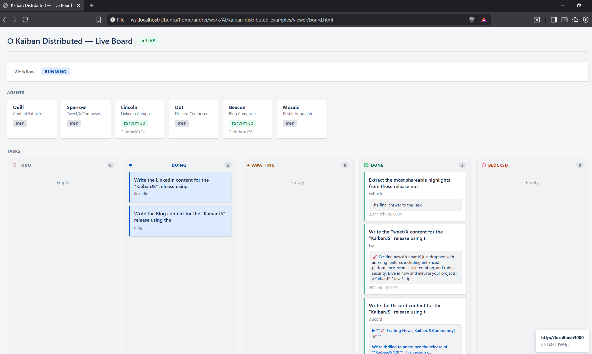
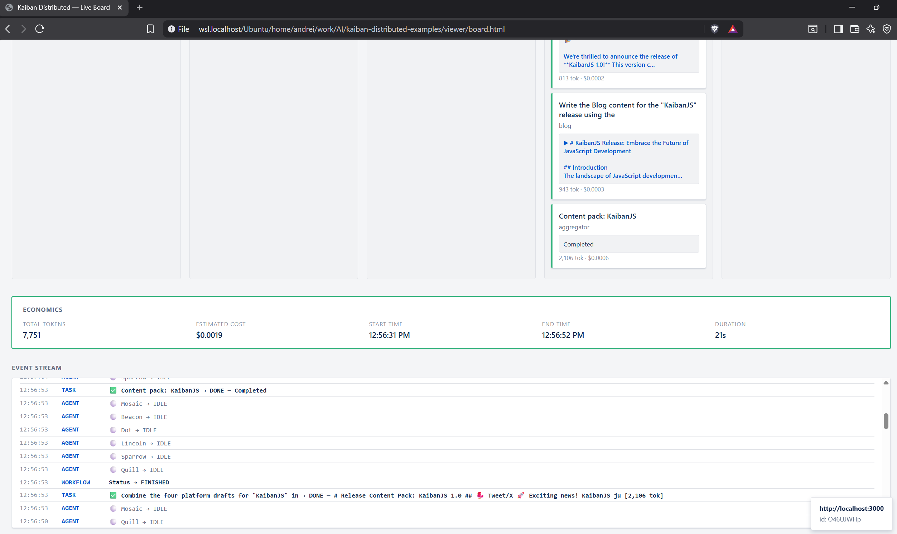
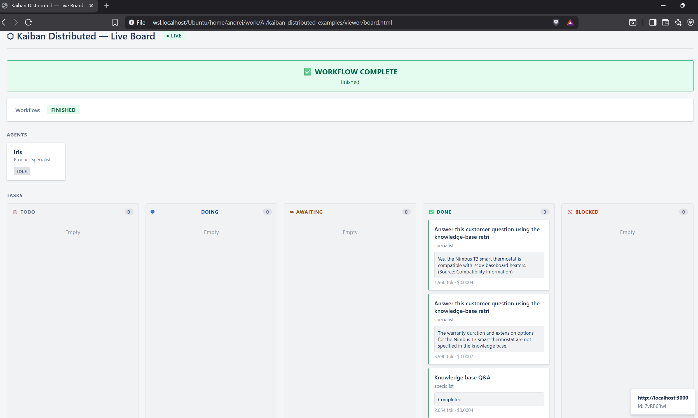
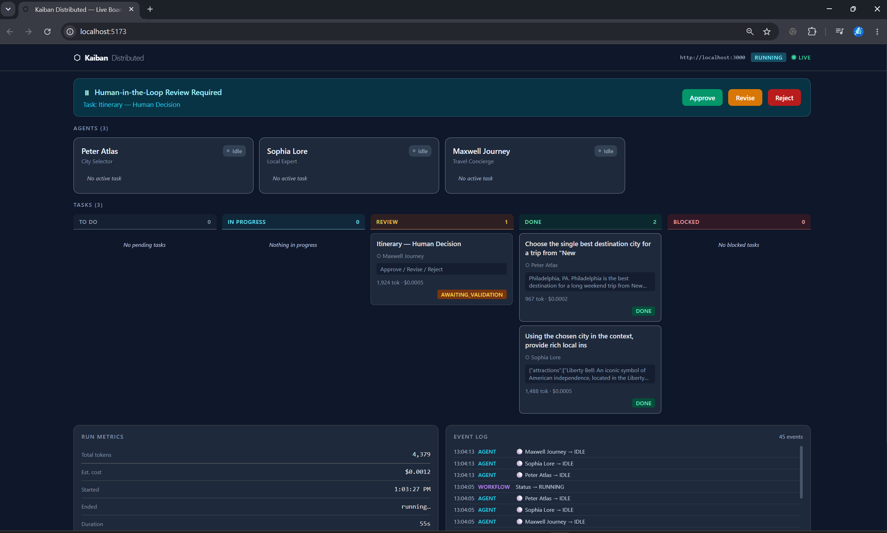
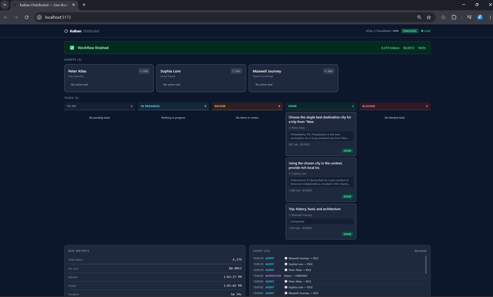
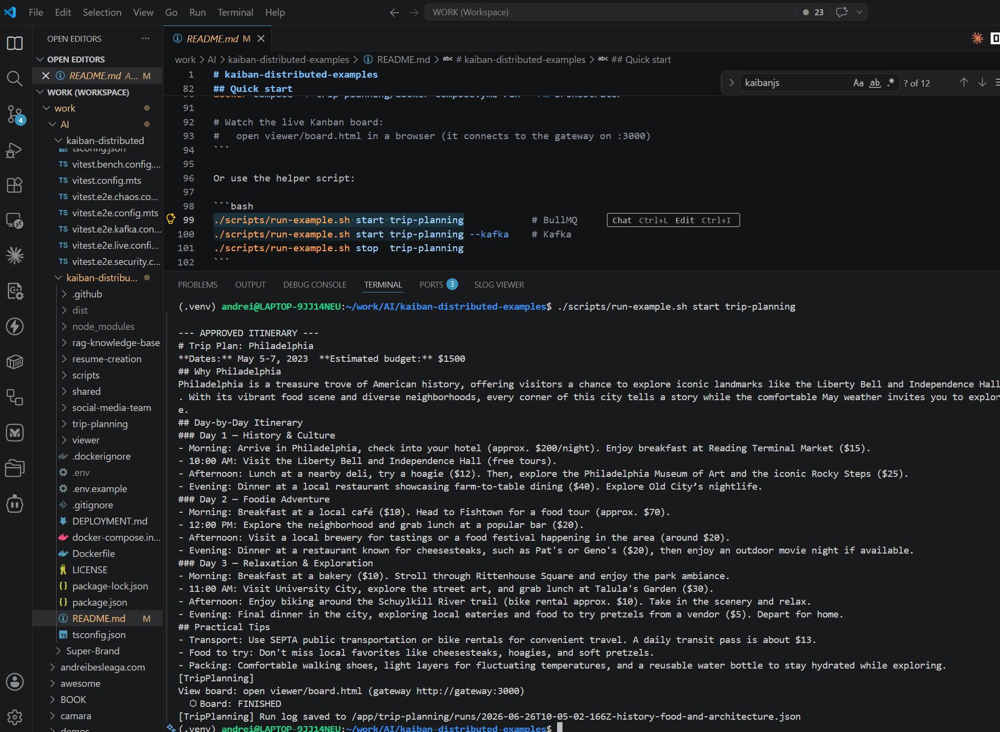

# kaiban-distributed-examples

> **Multi-agent AI as distributed, stateful actors.**

Most agent frameworks ship as a single, in-process, sequential scripts: when one step
crashes it can break the whole run, and "scaling" means a bigger box or paying more for different online services. **[Kaiban Distributed](https://github.com/andreibesleaga/kaiban-distributed)**
is the **first project to bring the Actor-Model paradigm to Multi-Agent Systems (MAS)** in
the JavaScript/TypeScript/Node.js ecosystem — an experimental, **production-shaped** runtime
where every agent is a **stateful actor in its own process**, communicating only by messages
over a pluggable **enterprise bus (Kafka / Redis-BullMQ / AMQP)**. If an agent fails it
crashes *cleanly* — Erlang/Kafka **"let it crash → DLQ"** applied to AI — without corrupting
the fleet, and you scale **horizontally** (`docker compose up --scale searcher=8`) as well as
**vertically** per node. This repo is a set of **runnable, completely-working examples** built
on that runtime; the live **Kanban board** renders every agent moving TODO → DOING → DONE in
real time.

**What makes it unique** — a world-first combination in JS/TS, for agents *and* humans:

- 🧩 **Swappable messaging layer** — toggle **Redis ⇄ Kafka** (AMQP next) with *zero* worker-code
  changes, and drop agents straight onto messaging infrastructure you already run.
- 📋 **Legible workflows** — a live **Kanban board** simple viewer, where **Human-in-the-Loop is a first-class
  workflow column**: visualize, pause, and intervene on the hard tasks.
- 🔌 **Standard federation** — built-in **A2A** gateway + **MCP** server/client (each agent can be
  its own A2A/MCP client or server), so a KaibanJS agent can orchestrate alongside **LangGraph /
  CrewAI** agents from different backends on one board.
- 🛡️ **FinOps & governance** — a hot-path **action gate** blocks rogue behavior *before* tokens are
  spent; hard `MAX_WORKFLOW_COST_USD` ceilings, audit logs, **OpenTelemetry**, GDPR-conscious,
  SOC2-ready, **100% core test coverage**, real-broker chaos suites, and a signed supply chain.
- ⚖️ Core library **dual-licensed Apache-2.0 / GPL** — safe to build on commercially.

<p align="center">
  <a href="images/KaibanExamples1.png"></a>
  <a href="images/KaibanExamples2.png"></a>
  <a href="images/KaibanExamples3.png"></a>
  <a href="images/KaibanExamples4.png"></a>
  <a href="images/KaibanExamples5.png"></a>
  <a href="images/KaibanExamples6.png"></a>
  <a href="images/KaibanExamples.gif"></a>
</p>

<sub align="center">↑ click any thumbnail to open it at full size</sub>

### These examples are deliberately simple — the point is the substrate

Each example here ([KaibanJS example](https://www.kaibanjs.com/examples) ports) could be implemented
in plain KaibanJS more simple, but they exist here to make the **distributed substrate tangible**:
the *same* agent code running as independent, message-passing, individually-scalable, observable
services with **checkpoint/resume** and **HITL**. The real payoff arrives at Enterprise Scale —
where Kaiban Distributed is meant to live:

- **Drop agents onto streams you already have.** Point a worker at an existing **Kafka topic /
  Redis stream / AMQP queue** and let agents read live data — transactions, logs, support tickets,
  telemetry, industrial/IoT events — and *act* on it, with infinite-retention logs, schemas, and
  near-real-time analytics from the underlying broker for free.
- **Absorb event spikes elastically.** A *Customer-Support mega-incident*: webhooks stream thousands
  of tickets into the A2A gateway, which load-balances across many "triage" nodes that use MCP to
  check customer/issue/severity and draft responses or escalate (awaiting validation) — scale nodes
  up during the spike, back down to save cost.
- **Run compliance-critical swarms.** A *Financial-Audit* swarm (OCR → Risk → Compliance → Fraud)
  that triggers a **HITL pause** the moment a violation is found and surfaces it on the board for
  manual sign-off — the level of control enterprises require.
- **Make classic, distributed software flows agentic.** Wrap existing microservice/streaming
  pipelines with agents plus human checkpoints so the most complex tasks — reading streams of
  information and running whole systems of work on them — become legible, governable, and affordable.

> 📖 Built alongside and featured in the author's upcoming book **Agentic AI Architectures**. Deep dive:
> the [Kaiban Distributed](https://github.com/andreibesleaga/kaiban-distributed) runtime (v2.0.0), with its examples (`blog-team` and `global-research`),
> and its [companion Medium article](https://lnkd.in/d_DSNFju).

> This is a separate repo by design — the core `kaiban-distributed` package keeps 100% coverage
> gate and core-only published artifact; these examples depend on the **published** package
> (`kaiban-distributed` + `kaiban-distributed/shared`), each agent its own worker process with a
> mailbox, coordinated over the message bus.
>
> Check the original repo [Kaiban Distributed](https://github.com/andreibesleaga/kaiban-distributed) for React Board Viewer with HITL, observability and more. The React Board is a more powerful front-end that hooks into the system for advanced visualization of the workflow than this repo simple HTML/JavaScript `viewer`.

## Examples

| Example | Topology | Demonstrates | Tools |
|---------|----------|--------------|-------|
| [resume-creation](resume-creation/) | Sequential 2-agent | The minimal "hello world" port — analyze → write | — |
| [trip-planning](trip-planning/) | Sequential 3-agent + HITL | Pipeline hand-off, checkpoint/resume, human approval | Tavily / Serper (optional) |
| [social-media-team](social-media-team/) | **Heterogeneous fan-out / fan-in** | 1 → 4 parallel composers → join (`waitAll`), partial-failure tolerance | — |
| [rag-knowledge-base](rag-knowledge-base/) | Single agent + retrieval tool | Real RAG (`SimpleRAG`) inside a distributed actor | `@kaibanjs/tools` SimpleRAG (needs OpenAI key) |

## Prerequisites

- Node.js ≥ 22, Docker (for Redis/Kafka + the containerised stacks)
- An LLM key: `OPENAI_API_KEY` **or** `OPENROUTER_API_KEY` (or a local
  OpenAI-compatible endpoint via `OPENAI_BASE_URL`)
- Optional per-example tool keys (see each example's README): `TAVILY_API_KEY`,
  `SERPER_API_KEY`. The RAG example needs `OPENAI_API_KEY` for embeddings.

## Quick start

```bash
npm install
cp .env.example .env            # add your OPENAI_API_KEY (or OPENROUTER_API_KEY)

# Fully containerised run of one example (redis + gateway + per-agent workers):
docker compose -f trip-planning/docker-compose.yml --env-file .env up -d --build
docker compose -f trip-planning/docker-compose.yml run --rm orchestrator

# Watch the live Kanban board:
#   open viewer/board.html in a browser (it connects to the gateway on :3000)
```

Or use the helper script:

```bash
./scripts/run-example.sh start trip-planning            # BullMQ
./scripts/run-example.sh start trip-planning --kafka    # Kafka
./scripts/run-example.sh stop  trip-planning
```

## Local-dev path (no example containers)

Bring up just Redis + the gateway, then run workers/orchestrators with `ts-node`:

```bash
docker compose -f docker-compose.infra.yml --env-file .env up -d --build
# each worker in its own terminal (example: trip-planning)
npx ts-node trip-planning/city-selector-node.ts
npx ts-node trip-planning/local-expert-node.ts
npx ts-node trip-planning/concierge-node.ts
# then drive it
npx ts-node trip-planning/orchestrator.ts
```

The orchestrator degrades gracefully if the gateway is down — the workflow still
completes; you just don't get the board.

## How a port is structured (the recipe)

Every example follows the same shape — copy it to add a new one:

```
<example>/
  team-config.ts     # agents as KaibanJS IAgentParams + queue names + tool wiring
  <role>-node.ts     # one worker per agent: startAgentNode({...})
  phases.ts          # per-phase: dispatchToAgent → router.wait / waitAll → forward context
  orchestrator.ts    # CompletionRouter + WorkflowOrchestrator (checkpoint) + budget + board + HITL
  docker-compose.yml # redis + gateway + one container per agent + cli-only orchestrator
  docker-compose.kafka.yml
  README.md
```

Shared building blocks live in [`shared/`](shared/): `state-publisher.ts`
(board lifecycle), `run-logger.ts` (structured run transcripts), `gateway.ts`
(resilient board connection), `agent-card.ts`. Everything else is imported from
the published package:

```ts
import { startAgentNode, CompletionRouter, WorkflowOrchestrator,
         RedisCheckpointStore, dispatchToAgent, waitForHITLDecision,
         workflowBudgetFromEnv, buildLLMConfig, createDriver } from "kaiban-distributed/shared";
import type { KaibanAgentConfig, IMessagingDriver } from "kaiban-distributed";
```

Attaching a tool is just adding it to the agent's `tools` array — the distributed
handler runs it unchanged because `KaibanAgentConfig` is KaibanJS's full
`IAgentParams`:

```ts
import { TavilySearchResults } from "@kaibanjs/tools/tavily";
const agent: KaibanAgentConfig = {
  name: "Peter Atlas", role: "City Selector", goal: "...",
  tools: [new TavilySearchResults({ apiKey: process.env.TAVILY_API_KEY!, maxResults: 5 })],
};
```

## Deployment

Each example is **not one web service** — it's a set of **long-lived, stateful actor
processes** that share a message bus: a **gateway** (HTTP + Socket.io board + A2A +
`/health`), **one worker process per agent** (each consuming its queue
`kaiban-agents-<id>`), a short-lived **orchestrator**, and the static **board**
(`viewer/board.html`). One Docker image ([`Dockerfile`](Dockerfile)) serves every role —
the role is chosen by the container's start `command` and a few env vars (`ROLE`/`AGENT_IDS`
for the gateway, `AGENT_ID` for a worker). Transport is **Redis/BullMQ** (default) or
**Kafka**, but **Redis is always required** (the live board + HITL channels use Redis
pub/sub even in Kafka mode). The rule everywhere: **one process per agent, always-on** —
workers are queue consumers, so don't put them on scale-to-zero serverless.

| Target | Fit / how |
|--------|-----------|
| **Local** | `docker compose -f <example>/docker-compose.yml up` (Redis + gateway + per-agent workers), or the ts-node dev path with `docker-compose.infra.yml`. |
| **Railway** | Easiest always-on fit: one service per role from the Dockerfile (override start command), Redis plugin → `REDIS_URL`, keys in secrets. |
| **Vercel\*** | Serverless does **not** fit the gateway or workers. Use it only for the **static board** and/or a thin "trigger a run" API against managed Redis (Upstash); run gateway + workers on an always-on host. |
| **AWS** | ECS/Fargate, one service per role + ElastiCache (Redis) or MSK (Kafka). Simpler: EC2 + docker compose. k8s: EKS. |
| **Azure** | Container Apps, one app per role with **`min-replicas ≥ 1`** + Azure Cache for Redis (or Event Hubs Kafka). Alt: AKS. |
| **GCP** | Cloud Run for the gateway; for workers you **must** set `--min-instances=1` + CPU always-allocated (no scale-to-zero), or use GKE/VM + Memorystore. |
| **Kubernetes** | One image, a Deployment per role with `ROLE`/`AGENT_ID` env; Redis/Kafka managed or in-cluster; HPA only for competing-consumer agents. |
| **Multi-device SLM swarm ⭐** | The differentiator: each agent runs on a **separate device** against one shared Redis (LAN/VPN/Tailscale) and a **local small model** via `OPENAI_BASE_URL` (Ollama/vLLM/LM Studio) — e.g. an 8B writer on a workstation, a 3B analyst on a laptop, a 1B classifier on a Pi. Heterogeneous, private, offline-capable, near-zero inference cost. |

See **[DEPLOYMENT.md](DEPLOYMENT.md)** for concrete per-target steps, env, diagrams, and caveats.

## Verification status

- `npm run build` and `npm run typecheck` — green for all three examples.
- Worker boot + board plumbing verified live against Redis (actor starts, IDLE
  state published to `kaiban-state-events`).
- End-to-end agent runs require your LLM key (and tool keys where noted); run any
  example's orchestrator to exercise the full pipeline + board.

## Appendix A — Upstream example feasibility (porting backlog)

The three shipped examples are the easy, high-value ports. The rest of the
[18 KaibanJS examples](https://www.kaibanjs.com/examples) map onto this runtime as
follows — same recipe, more agents:

| Upstream example | Topology | Port tier | Notes |
|---|---|---|---|
| **Resume Creation** | 2, sequential | ✅ shipped | — |
| **Trip Planning** | 3, sequential | ✅ shipped | — |
| Company Research | 6–7 → compiler | Easy | Larger fan-out/fan-in (search tool) |
| **GitHub Social Media Team** | 1→4→1 fan-out/in | ✅ shipped | — |
| Airline Re-accommodation / Seat Upsell / Revenue Mgmt | 4–6 pipeline | Medium | Pure reasoning; domain-heavy |
| **RAG Product Knowledge Base** | 1 + tool | ✅ shipped | — |
| Conference Audio Analysis | 4, sequential | Medium | Audio input may exceed the 64 KB message cap |
| A2A Protocol Integration | — | Skip | Redundant — the runtime already ships A2A federation |
| Kaiban-Platform / MCP-card / OpenClaw / Claude-Code demos | — | Skip | Coupled to hosted platforms or external CLIs |
| WorkflowDriven & ReactChampion | mixed agent classes | Defer | Needs bridge support for special agent types |

## Appendix B — `@kaibanjs/tools` quick reference

Subpath import per tool, construct with its key, attach via the agent `tools` array:

`@kaibanjs/tools/{tavily,serper,exa,firecrawl,wolframalpha,github-issues,`
`jina-url-to-markdown,pdf-search,simple-rag,simple-rag-retrieve,website-search,`
`textfile-search,zapier-webhook,make-webhook}`

## License

GPL-3.0-or-later (example/app code), depending on the Apache-2.0 published
`kaiban-distributed` core. Core source is not vendored here.
